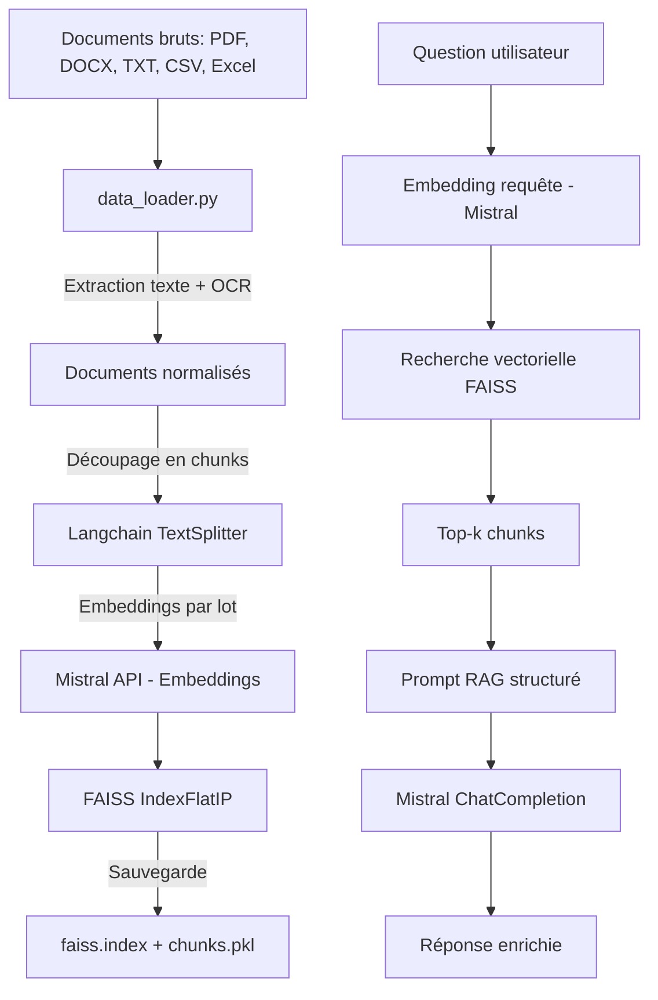
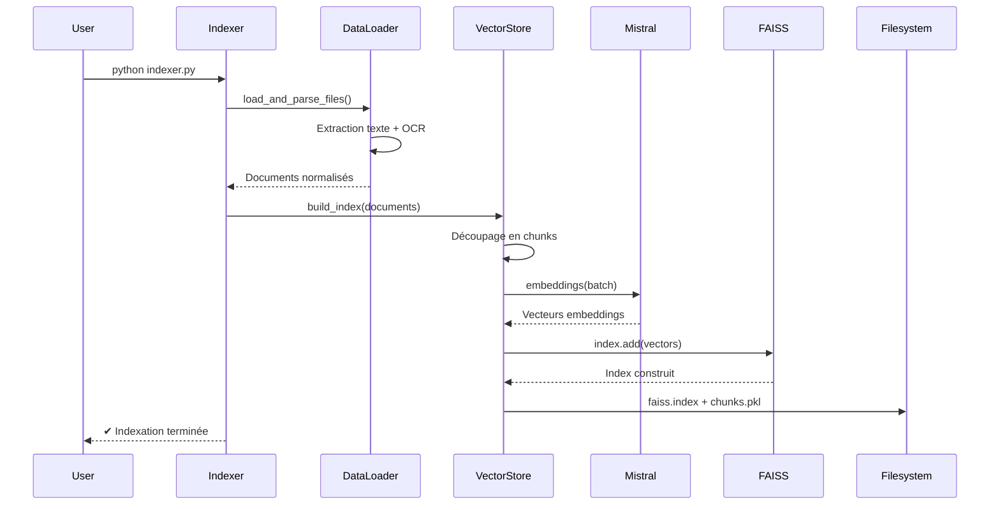
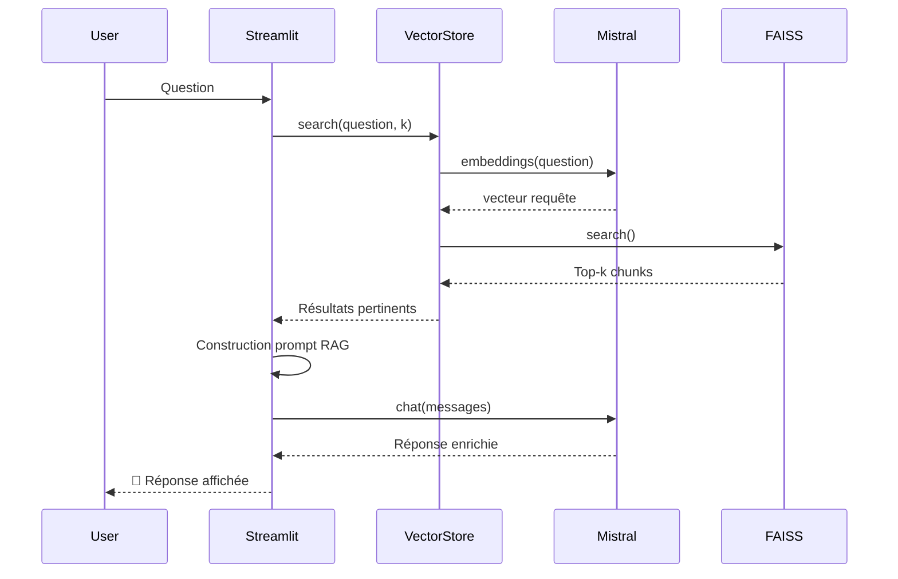

# NBA Assistant -  RAG avec Mistral

**Assistant intelligent NBA** basé sur une architecture **RAG (Retrieval-Augmented Generation)**,  pour fournir des réponses précises et contextuelles aux questions sur les matchs et statistiques de basketbal, à partir d'une base de connaissances personnalisée.
Ce projet implémente un assistant virtuel basé sur le modèle Mistral, utilisant la technique de Retrieval-Augmented Generation (RAG)

Il combine :

- **Mistral AI** → génération + embeddings  
- **FAISS** → index vectoriel local  
- **Langchain Text Splitter** → découpage des documents  
- **Streamlit** → interface de chat  
- **EasyOCR + PyMuPDF** → extraction texte PDF (fallback OCR)  
- **Pandas, docx, etc.** → parsing multi-formats  
- **Pipeline complet d’ingestion → indexation → interrogation**

---

## Fonctionnalités

- 🔍 **Recherche sémantique** avec FAISS pour trouver les documents pertinents
- 🤖 **Génération de réponses** avec les modèles Mistral (Small ou Large)
- ⚙️ **Paramètres personnalisables** (modèle, nombre de documents, score minimum)

---

## Prérequis

- Python 3.12+ 
- Clé API Mistral (obtenue sur [console.mistral.ai](https://console.mistral.ai/))

---


## Installation

1. **Cloner le dépôt**

```bash
git clone https://github.com/RomaneFatima-Zahra/P10_RAG_SportSee
cd P10_RAG_SportSee
```

2. **Créer un environnement virtuel**

```bash
poetry install
poetry shell
```

3. **Installer les dépendances**

pip install -r requirements.txt


4. **Configurer la clé API**

Créez un fichier `.env` à la racine du projet avec le contenu suivant :

```
MISTRAL_API_KEY=votre_clé_api_mistral
```

---

## Structure du projet

```
P10_DSML/
├── MistralChat.py          # Application Streamlit principale
├── indexer.py              # Script pour indexer les documents
├── requirements.txt        # Dépendances Python
├── pyproject.toml          # Configuration env poetry
├── poetry.lock             # Configuration poetry
├── .env                    # Variables d'environnement ( fichier caché)
├── inputs/                 # Dossier pour les documents sources
│   ├── Reddit 1.pdf        # Commentaires matchs NBA
│   └── Reddit 2.pdf        # Commentaires matchs NBA
│   └── Reddit 3.pdf        # Commentaires matchs NBA
│   └── Reddit 4.pdf        # Commentaires matchs NBA
│   └── regular NBA.xlsx    # Statistiques joueurs
├── vector_db/              # Dossier pour l'index FAISS et les chunks
│   ├── faiss_index.idx     # Index FAISS
│   └── document_chunks.pkl # Chunks 
└── utils/                  # Modules utilitaires
    ├── config.py           # Configuration de l'application
    ├── data_loader.py      # Extraction de texte multi-format (PDF, DOCX, Excel, CSV, TXT)
    └── vector_store.py     # Gestion de l'index vectoriel + Recherche sémantique
```

---

## Architecture  du système



Pipeline d'indexation



Pipeline RAG



---

## Utilisation

### 1. Ajouter des documents

Placez vos documents dans le dossier `inputs/`. Les formats supportés sont :
- PDF
- TXT
- DOCX
- CSV
- JSON

Vous pouvez organiser vos documents dans des sous-dossiers pour une meilleure organisation.

### 2. Indexer les documents

Exécutez le script d'indexation pour traiter les documents et créer l'index FAISS :

```bash
python indexer.py
```

Ce script va :
1. Charger les documents depuis le dossier `inputs/`
2. Découper les documents en chunks
3. Générer des embeddings avec Mistral
4. Créer un index FAISS pour la recherche sémantique
5. Sauvegarder l'index et les chunks dans le dossier `vector_db/`

### 3. Lancer l'application

```bash
streamlit run MistralChat.py
```

L'application sera accessible à l'adresse http://localhost:8501 dans votre navigateur.

---

## Modules principaux

| Composant | Rôle |
|-----------|------|
| **MistralChat.py** | Interface utilisateur Streamlit pour poser des questions |
| **indexer.py** | Exécutez le script d'indexation pour traiter les documents et créer l'index FAISS |
| **config.py** | Configuration de l'application |
| **data_loader.py** | Extraction de texte multi-format (PDF, DOCX, Excel, CSV, TXT) |
| **vector_store.py** | Gestionnaire de l'index vectoriel FAISS et recherche sémantique |

---

**Auteur** : Fatima-Zahra BARHOU - Projet P10  
**Date** : Décembre 2025

---