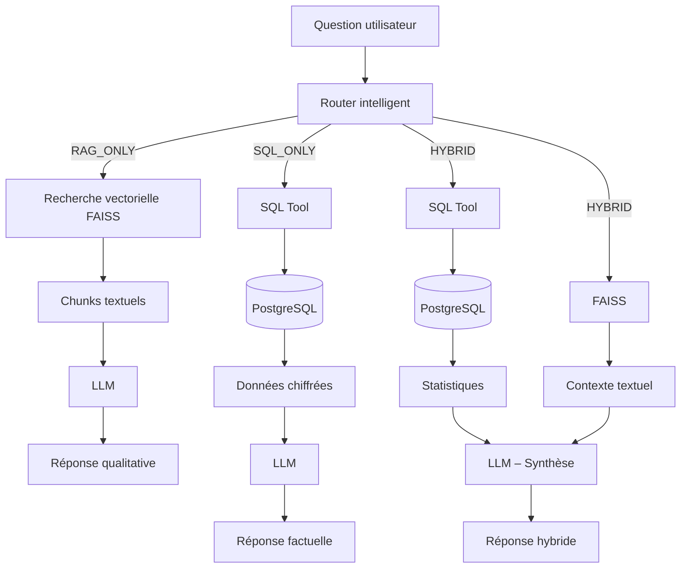
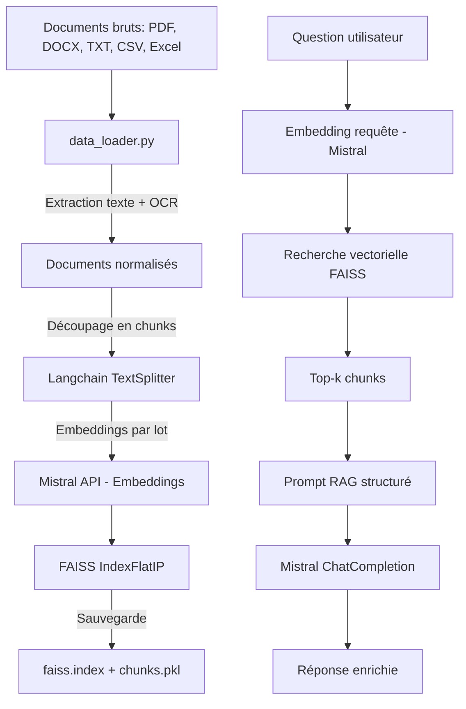
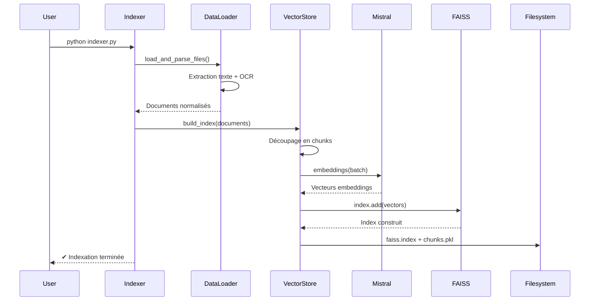
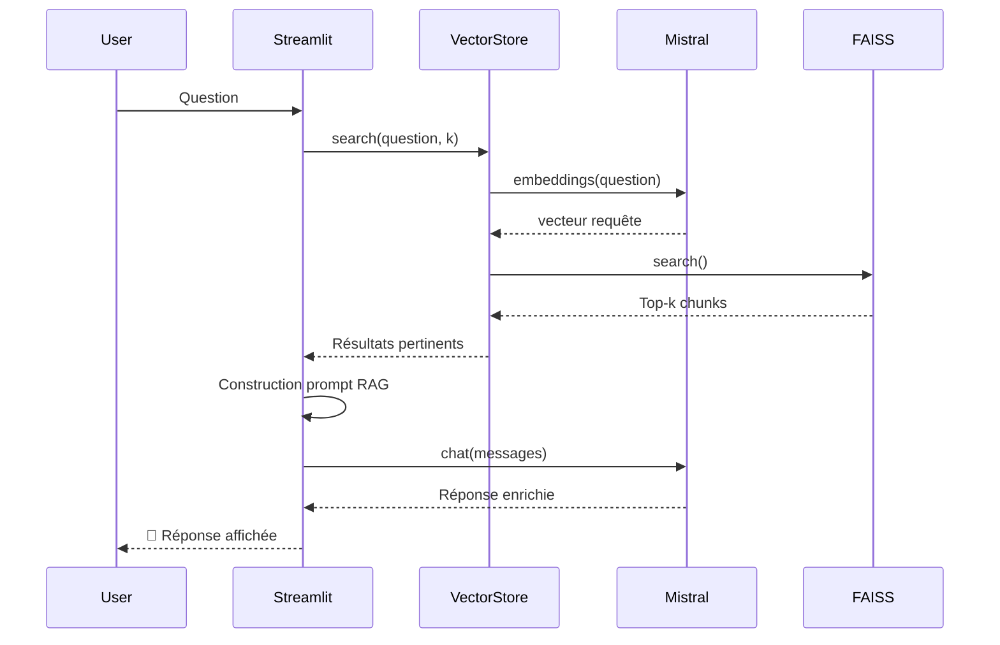

# NBA Assistant -  RAG avec Mistral 🏀

**Assistant intelligent NBA** basé sur une architecture **RAG (Retrieval-Augmented Generation)**,  pour fournir des réponses précises et contextuelles aux questions sur les matchs et statistiques de basketbal, à partir d'une base de connaissances personnalisée.
Ce projet implémente un assistant virtuel basé sur le modèle Mistral, utilisant la technique de Retrieval-Augmented Generation (RAG)
Ce projet a évolué d’un RAG classique vers une architecture hybride spécialisée, capable de :
exploiter chaque type de donnée selon sa nature
réduire drastiquement les hallucinations
améliorer la précision des réponses statistiques
garantir la traçabilité et la cohérence des résultats

L’objectif n’est pas uniquement de générer des réponses, mais de produire des réponses fiables et exploitables dans un contexte professionnel d’analyse sportive.

---

##  🧠 Technologies utilisées

### IA & RAG
- **Mistral AI**
  - Génération de réponses
  - Embeddings (1024 dimensions)
- **FAISS (IndexFlatIP)**  
  - Recherche vectorielle locale
- **LangChain Text Splitter**  
  - Chunking des documents textuels

### Données structurées
- **PostgreSQL**  
  - Stockage des statistiques NBA
- **SQL Tool (LangChain)**  
  - Génération dynamique de requêtes SQL (NL → SQL)
- **Pydantic**  
  - Validation stricte des données (Excel → SQL)

### Pipeline & Interface
- **Streamlit** → Interface utilisateur  
- **EasyOCR + PyMuPDF** → OCR PDF (fallback)  
- **Pandas** → Parsing et transformation des données 

---

## ⚙️ Fonctionnalités principales

### 🔍 RAG Textuel (PDF / Reddit)
- Recherche sémantique avec FAISS
- Synthèse des discussions et analyses qualitatives
- Réponses contextualisées

### 📊 SQL Tool (Statistiques NBA)
- Génération automatique de requêtes SQL à partir du langage naturel
- Exécution sécurisée (SELECT uniquement)
- Résultats chiffrés précis et vérifiables

### 🧭 Router intelligent
- Détection automatique du type de question :
  - **RAG_ONLY** → questions qualitatives
  - **SQL_ONLY** → questions statistiques
  - **HYBRID** → statistiques + interprétation
- Orchestration dynamique du pipeline


---

## 🗂️ Sources de données

- **PDF Reddit** : discussions, opinions, analyses de fans
- **Excel NBA** : statistiques joueurs et équipes
- **PostgreSQL** : base relationnelle issue de la migration Excel

---

## 🧩 Architecture globale



---

## Architecture antérieure du système



Pipeline d'indexation



Pipeline RAG



---

## Prérequis

- Python 3.12+ 
- Clé API Mistral (obtenue sur [console.mistral.ai](https://console.mistral.ai/))

---


## Installation et Utilisation

1. **Cloner le dépôt**

```bash
git clone https://github.com/RomaneFatima-Zahra/P10_RAG_SportSee
cd P10_RAG_SportSee
```

2. **Créer un environnement virtuel**

```bash
poetry install
poetry shell
```

3. **Installer les dépendances**

pip install -r requirements.txt


4. **Configurer la clé API**

Créez un fichier `.env` à la racine du projet avec le contenu suivant :

```
MISTRAL_API_KEY=votre_clé_api_mistral
```

5. **Initialiser les bases de données PostgreSQL (statistiques NBA) :**

Installez PostgreSQL 17 : [Télécharger ici](https://www.postgresql.org/download/)

Créez la base de données :
```bash
# Ouvrez psql (terminal PostgreSQL)
# À l'installation, vous avez défini un mot de passe pour l'utilisateur 'postgres'
psql -U postgres
CREATE DATABASE nba_stats;
\q

Chargez les données :
```bash
python scripts/load_excel_to_db.py
```
BDD enrichie avec les données excel.

6. **FAISS (discussions Reddit) :**
```bash
python scripts/indexer.py
```
Ce script va :
Charger les documents depuis le dossier `inputs/`
Découper les documents en chunks
Générer des embeddings avec Mistral
Créer un index FAISS pour la recherche sémantique
Sauvegarder l'index et les chunks dans le dossier `vector_db/`


7. **Lancer l'assistant virtuel**

Dans le terminal, tapez cette commande :
```bash
streamlit run MistralChat.py  # Lance l'interface
```

L'application sera accessible à l'adresse http://localhost:8501 dans votre navigateur.

**✅ Une page web s'ouvre automatiquement dans votre navigateur !**

**🎉 Posez votre première question**

---

## Structure du projet

```

P10_DSML/
├── MistralChat.py          # Application Streamlit principale 
├── indexer.py              # Script pour indexer les documents
├── requirements.txt        # Dépendances Python
├── pyproject.toml          # Configuration env poetry
├── poetry.lock             # Configuration poetry
├── .env                    # Variables d'environnement ( fichier caché)
│
│── Scripts/
│	├── load_excel_to_db.py # Loading de Excel vers BDD SQL
│   │── sql_tool.py         # Générer et exécuter des requêtes SQL dynamiques
│	│── router.py 			# Routing intelligent de questions
│ 	└── test_router.py  	# Test du router.py
│
├── Ragas_eval/
│	├── evaluate_ragas.py   # Evaluation Ragas
│   └── evaluation_results/ # Résultats de l'évaluation
│	└── router_analysis/  	# Résultats de test de routing
│     
├── inputs/                 # Dossier pour les documents sources
│   ├── Reddit 1.pdf        # Commentaires matchs NBA
│   └── Reddit 2.pdf        # Commentaires matchs NBA
│   └── Reddit 3.pdf        # Commentaires matchs NBA
│   └── Reddit 4.pdf        # Commentaires matchs NBA
│   └── regular NBA.xlsx    # Statistiques joueurs
│ 
│ 
├── vector_db/              # Dossier pour l'index FAISS et les chunks
│   ├── faiss_index.idx     # Index FAISS
│   └── document_chunks.pkl # Chunks 
│ 
└── utils/                  # Modules utilitaires
    ├── config.py           # Configuration de l'application
    ├── data_loader.py      # Extraction de texte multi-format (PDF, DOCX, Excel, CSV, TXT)
    └── vector_store.py     # Gestion de l'index vectoriel + Recherche sémantique
```

---

## Modules principaux

| Composant | Rôle |
|-----------|------|
| **MistralChat.py** | Interface utilisateur Streamlit pour poser des questions |
| **indexer.py** | Exécutez le script d'indexation pour traiter les documents et créer l'index FAISS |
| **config.py** | Configuration de l'application |
| **data_loader.py** | Extraction de texte multi-format (PDF, DOCX, Excel, CSV, TXT) |
| **vector_store.py** | Gestionnaire de l'index vectoriel FAISS et recherche sémantique |
| **sql_tool.py**        | Générer et exécuter des requêtes SQL dynamiques |
| **router.py**		     |Routing intelligent de questions                     |               

---


## 📊 Évaluation & Qualité

Évaluation avec RAGAS avant et après amélioration du système RAG

Améliorations majeures sur :

Context Precision (Excel)

Context Recall (Excel & Mixte)

Faithfulness (SQL_ONLY = 100 %)

Choix assumé d’un système plus conservateur mais nettement plus fiable

🎯 Objectif final

Construire un assistant NBA de niveau professionnel, capable de :

répondre précisément aux questions statistiques,

interpréter les données dans leur contexte,

éviter les hallucinations,

fournir des réponses exploitables pour l’analyse de performance sportive.

## 🔮 Perspectives

Ajout de nouvelles saisons et agrégations temporelles

Amélioration de la fusion RAG + SQL

Enrichissement du router (LLM-based)

Déploiement multi-clubs

Explication détaillées dans Rapport.md

---

**Auteur** : Fatima-Zahra BARHOU - Projet P10  
**Date** : Décembre 2025

---